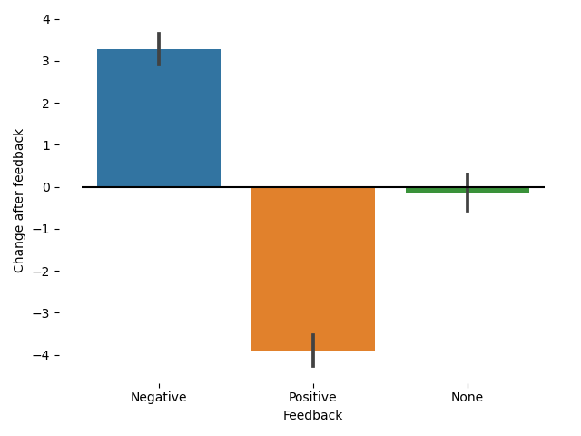

There was a [post](https://octodon.social/@derwinmcgeary/111921298436478955) on Mastodon recently about why negative feedback in teaching does not cause better learning. I thought the post was clear and concise, and could elicit the right intuition, but it didn't exactly explain the background that was being applied (the purpose was to be funny and intuitive, not explanatory). I also thought it would be a great opportunity to practice my programming and stats again, so here's the simulation, an explanation, and some lessons to draw from it.

The post invited the reader to do the following:

> Grab a couple of dice. Roll them.
> 
> If you get below 5, those are rookie numbers. Shout at the dice, let them know they're underperforming.
> 
> If you get above 9, that's what we want to see! They're good dice, and you should acknowledge that.
> 
> Repeat that and keep a record. You'll notice that negative feedback often results in better performance on the next roll. Positive feedback, conversely, can make them get lazy.

If you run the simulation and calculate how much change occurs after each type of feedback (I'll post the code at the end), the results are the following:



Amazing! The dice that performed poorly, after receiving negative feedback, improved substantially! Conversely, the dice that did well, after receiving positive feedback, did worse at the next try. One could therefore conclude that negative feedback improves performance, while positive feedback hinders it. This aligns well with the intuition some teachers may have that we should focus on negative feedback and prevent our students from becoming lazy after getting positive feedback. However, it would be very strange to think that giving the dice feedback somehow changed their performance. Therefore, we must conclude that something else is going on.

The phenomenon happening here is a well-known phenomenon in statistics: [regression toward the mean](https://en.wikipedia.org/wiki/Regression_toward_the_mean). The idea is that when the dice perform poorly, it is more likely that they will perform better on the next try relative to their initial poor performance. This is simply because of how probability works: if the dice performed poorly, there's just more options for them to perform better than their initial result on the next try. Similarly, if the dice performed well, there are fewer possibilities that they will perform even better on the next try, and therefore it is more likely that they will perform worse. To make the point explicit, consider one try in which the dice roll was 3. What is the probability that, relative to this throw, the next one will be better? It is easy to see that any result >= 4 will do the job. There are 9 possible numbers out of 12 that this occurs (getting a 4, 5, 6, 7, 8, 9, 10, 11, or 12), and therefore there is a 9/12 = 3/4 = 0.75 chance that the dice will perform better. The same calculation works in case the dice performed well.[^Edit]

What does this have to do with teaching? The post on Mastodon implied, and we can explicitly claim, that improved performance after receiving negative feedback during a bad performance does not cause better results, even if better results are observed on the next try. Put differently, if we observe that our students improve their performance after they don't perform well, we cannot attribute this effect to negative feedback alone. In fact, we might not have provided any feedback at all, and it would have been somewhat probable that we observed similar results.

There are a few caveats to consider, though. The experiment above occurs in conditions where each throw is independent of the previous one. Of course, we do not expect each throw to affect the next one. But teaching does not work this way. Feedback after one performance does affect the next one because students might become more or less motivated, confident, or anxious. Consequently, while this experiment helps model the teaching scenario, it does not respect some nuances that might be relevant.

Yet, I think raising awareness about this statistical phenomenon is important because it shows what evidence is required to claim that a specific kind of feedback has an effect on students. As the experiment shows, merely observing differences in performance is not sufficient to claim that any kind of feedback is what is doing the work, i.e., that it is causally relevant. What we need to think about, in my opinion, is exactly what we intend to modify for better learning and whether we are doing it through our feedback. Whether the feedback is positive or negative might be less relevant (besides affecting our students emotionally) than, for example, offering clear descriptions of errors, suggesting strategies to overcome them, and pointing our students in the right direction. We can do that in ways that do not make them feel even more anxious and less confident, and this, I believe, will have a causal effect on their learning.

[^Edit]: Someone else on Mastodon pointed out that [it's not the same throwing one 12-sided die (1d12) than throwing two 6-sided dice (2d6)](https://xoxo.zone/@KevinMarks/112070933934701153). My previous code was 1d12, but now I changed it to 2d6. This has two consequences. First, the distribution of rolls changes, because 1d12 has a uniform distribution (we are equally likely to get each number) while 2d6 has a distribution that better approximates a normal distribution (7---the mean---is more likely than 12). Because of this, the probability of obtaining a 4 or better changes, because now it's even more likely (approx. 0.917). The initial figure remains more or less the same, though, so I didn't change it.

---

As promised, here is my quick and dirty Python code:

```python
from random import randint
import pandas as pd
import seaborn as sns
import matplotlib.pyplot as plt

dice_rolls = [sum((randint(1, 6), randint(1, 6))) for _ in range(1000)]

feedback = []
for result in dice_rolls:
    if result <= 5:
        feedback.append("Negative")
    elif result >= 9:
        feedback.append("Positive")
    else:
        feedback.append("None")

df = pd.DataFrame(zip(dice_rolls, feedback), columns=["Result", "Feedback"])
df["Next"] = df["Result"].shift(-1) - df["Result"]

ax = sns.barplot(data=df, x="Feedback", y="Next")
ax.set_ylabel("Change after feedback")

ax.hlines(0, -0.5, 2.5, colors="Black")

for spine in ax.spines:
    ax.spines[spine].set_visible(False)

plt.tight_layout()
plt.savefig("example.png")
```